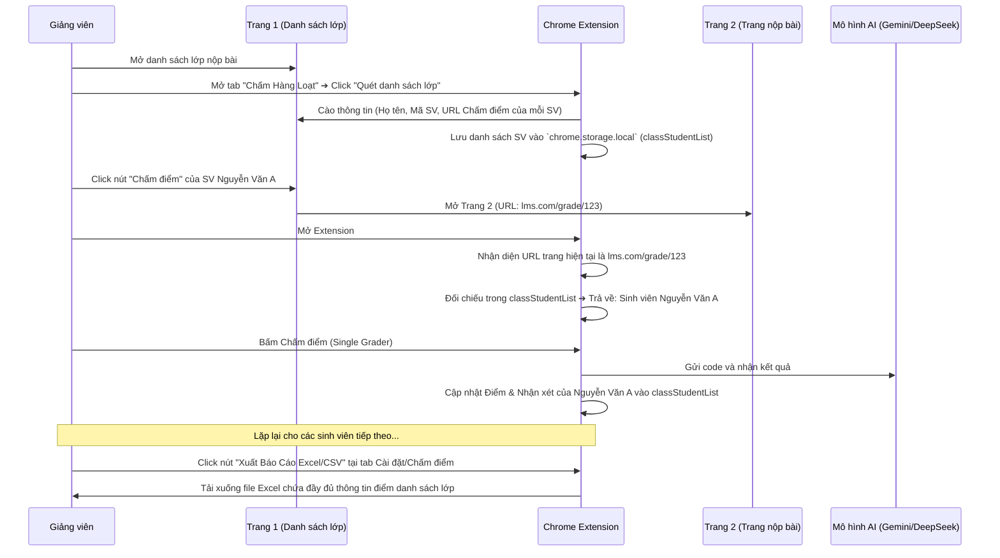

# 🤖 Kế hoạch Triển khai: Liên kết dữ liệu sinh viên đa trang & Xuất Báo Cáo Điểm số v3.3.0

Tài liệu này đề xuất giải pháp kỹ thuật và kế hoạch chi tiết để thu thập thông tin sinh viên từ **Trang danh sách lớp (Trang trước)**, liên kết tự động khi chấm điểm ở **Trang nộp bài (Trang hiện tại)** và tổng hợp xuất báo cáo Excel/CSV.

---

## 1. Phân Tích Hiện Trạng & Bài Toán
* **Trang 1 (Trang trước - Danh sách lớp):** Chứa thông tin định danh của sinh viên (Họ tên, Mã SV, email) và một nút bấm "Chấm điểm" dẫn tới đường dẫn nộp bài của sinh viên đó.
* **Trang 2 (Trang hiện tại - Chi tiết nộp bài):** Chứa link bài làm GitHub và tên Bài tập, nhưng **thiếu thông tin tên sinh viên** hoặc mã sinh viên.
* **Mục tiêu:** Khi giảng viên duyệt chấm điểm từng sinh viên ở Trang 2, Extension phải tự động biết bài này là của sinh viên nào (đã quét ở Trang 1), lưu lại điểm số/nhận xét của sinh viên đó và cho phép xuất báo cáo Excel/CSV chứa đầy đủ: **Mã SV, Họ Tên, Bài Tập, Link GitHub, Điểm Số, Nhận xét**.

---

## 2. Giải Pháp Kỹ Thuật: Bản đồ liên kết URL (URL Mapping State)

Chúng ta sẽ sử dụng đường dẫn **URL chi tiết bài nộp (Submission URL)** làm từ khóa liên kết duy nhất (Unique Key) giữa hai trang.

### Sơ đồ luồng hoạt động (Workflow):

---

## 3. Các thay đổi đề xuất

### 📁 Thêm mới / Cập nhật các Tệp Tin

#### [MODIFY] [popup.html](file:///s:/WorkSpace/RikkeiEducation/AutoScoring/AutoScoring/extension/popup.html)
* **Tab Quét & Chấm Hàng Loạt:** 
  * Cập nhật giao diện quét: hỗ trợ 2 chế độ quét:
    1. *Chế độ 1: Quét danh sách nộp bài trực tiếp (Quét link GitHub hiện có trên trang).*
    2. *Chế độ 2: Quét danh sách lớp học (Lưu thông tin Sinh viên & URL nộp bài).*
  * Bổ sung nút **"📥 Quét & Lưu Danh Sách Lớp"** và nút **"📊 Xuất Báo Cáo CSV lớp"**.

#### [MODIFY] [autoGraderTab.js](file:///s:/WorkSpace/RikkeiEducation/AutoScoring/AutoScoring/extension/controllers/autoGraderTab.js)
* Bổ sung hàm cào Trang danh sách lớp để trích xuất: Họ tên, Mã SV, và link dẫn tới trang chấm điểm.
* Xây dựng cơ chế lưu danh sách sinh viên lớp học vào bộ nhớ `chrome.storage.local` dưới khóa `classStudentList`.
* Viết hàm xuất dữ liệu `classStudentList` ra file định dạng CSV hỗ trợ Tiếng Việt (Unicode BOM) để mở trực tiếp trên Excel không bị lỗi phông chữ.

#### [MODIFY] [singleGraderTab.js](file:///s:/WorkSpace/RikkeiEducation/AutoScoring/AutoScoring/extension/controllers/singleGraderTab.js)
* Khi khởi chạy tab Chấm Đơn:
  * Tự động lấy URL hiện tại của tab, đối chiếu trong `classStudentList` để tìm xem đang chấm bài cho sinh viên nào.
  * Hiển thị thông báo nhỏ trên giao diện: `"Đang chấm bài cho: [Tên Sinh Viên] - [Mã SV]"`.
  * Sau khi AI chấm xong, tự động cập nhật điểm số và nhận xét của sinh viên đó vào `classStudentList`.

#### [MODIFY] [lmsScraper.js](file:///s:/WorkSpace/RikkeiEducation/AutoScoring/AutoScoring/extension/lmsScraper.js)
* Cấu hình nâng cao để nhận diện linh hoạt các cấu trúc bảng danh sách học viên của Rikkei LMS.

---

## 4. Kế hoạch xác minh (Verification Plan)

### Kiểm thử thủ công:
1. **Bước 1 (Trang Danh Sách):** Mở trang danh sách lớp học chứa danh sách sinh viên. Mở Extension, bấm **Quét danh sách lớp**. Kiểm tra bảng hiển thị trong Extension xem có đầy đủ: Tên, Mã SV và link nộp bài hay không.
2. **Bước 2 (Trang Chấm Bài):** Click nút "Chấm bài" của sinh viên đầu tiên để chuyển sang trang chi tiết. Mở Extension, tab **Chấm Đơn** phải hiển thị đúng dòng chữ: *"Đang chấm bài cho sinh viên: Nguyễn Văn A"*.
3. **Bước 3 (Chấm điểm & Lưu):** Tiến hành chấm bài. Đảm bảo điểm số và nhận xét được lưu trữ cục bộ.
4. **Bước 4 (Xuất Báo cáo):** Bấm nút **Xuất Báo Cáo CSV**. Tải file về, mở bằng Excel và kiểm tra tính chính xác của các cột dữ liệu.
