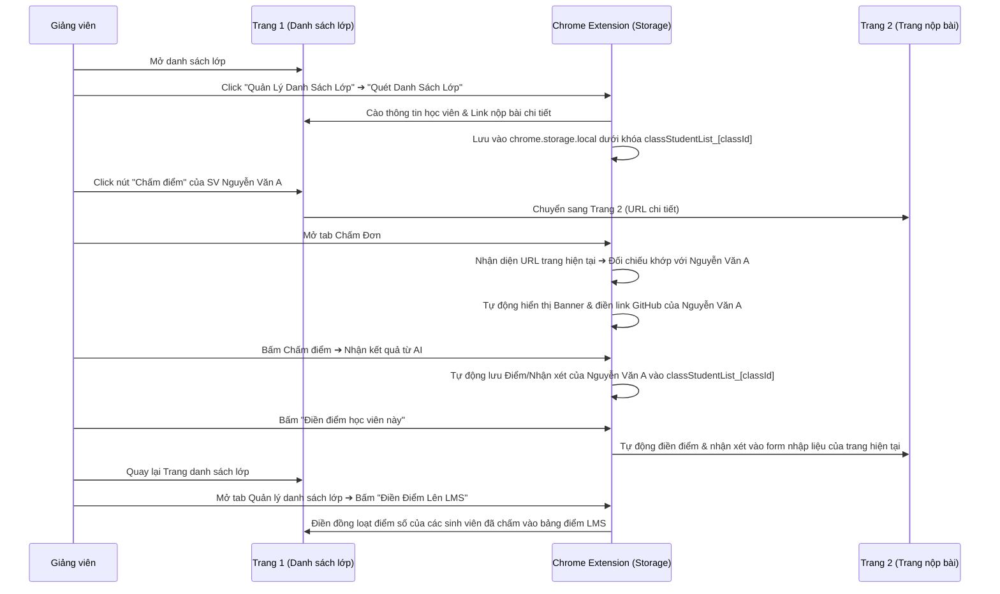

# 🤖 Kế hoạch Triển khai Tối ưu hóa: Liên kết dữ liệu sinh viên đa trang & Tự động điền điểm LMS v3.3.0

Tài liệu này đề xuất giải pháp kỹ thuật tối ưu hóa kế hoạch **v3.3.0**, nhằm giải quyết triệt để bài toán đồng bộ hóa dữ liệu chấm điểm của học viên giữa **Trang Danh Sách Lớp (Trang trước)** và **Trang Chi Tiết Nộp Bài (Trang hiện tại)**, đồng thời giới thiệu tính năng đột phá **Tự động điền điểm trực tiếp vào LMS (LMS Auto-Fill)**.

---

## 1. Phân Tích Hiện Trạng & Đề Xuất Cải Tiến Tối Ưu

Trong quy trình chấm bài truyền thống, giảng viên gặp 3 rào cản lớn:
1. **Mất thông tin định danh:** Trang chi tiết nộp bài (Trang 2) chỉ có mã nguồn/GitHub link của học sinh mà không hiển thị Mã SV hay Họ Tên học sinh đó.
2. **Ghi đè chéo lớp (Cross-class Overwrite):** Lưu trữ danh sách học viên chung (`classStudentList`) sẽ bị đè khi giảng viên đổi tab/chuyển lớp học.
3. **Thủ công nhập điểm:** Giảng viên phải tự tay nhập lại điểm số và nhận xét từ Extension vào các ô nhập liệu trên giao diện web của LMS.

### Giải pháp Tối ưu hóa triển khai:
* **Chuẩn hóa URL thông minh (Smart URL Normalization):** Loại bỏ giao thức (`http/https`), truy vấn (`?query=`), hash (`#hash`), và dấu gạch chéo cuối trang để đối chiếu chính xác tuyệt đối.
* **Lưu trữ phân loại theo Lớp học (Class-scoped Storage):** Dữ liệu học viên lưu dạng `classStudentList_[classId]`, trong đó `classId` là mã hash thu được từ URL trang danh sách lớp.
* **Tự động điền điểm vào LMS (LMS Auto-Fill):** Hỗ trợ điền đồng loạt từ bảng danh sách lớp (Trang 1) hoặc điền đơn lẻ tại trang chấm chi tiết (Trang 2).
* **Tìm kiếm thời gian thực & Thống kê trực quan:** Bổ sung thanh tìm kiếm nhanh học viên và dashboard thống kê tiến độ chấm điểm.

---

## 2. Sơ đồ luồng hoạt động tối ưu (Optimized Workflow)

---

## 3. Các thay đổi đề xuất chi tiết

### 📁 Thêm mới / Cập nhật các Tệp Tin

#### [MODIFY] [lmsScraper.js](file:///s:/WorkSpace/RikkeiEducation/AutoScoring/AutoScoring/extension/lmsScraper.js)
* Bổ sung hàm scraper chuyên biệt cho Trang Danh sách Lớp:
  * Trích xuất: **Mã SV, Họ Tên, Link Chấm bài chi tiết**.
  * Định nghĩa cơ chế Fallback selectors đa dạng cho Rikkei LMS để dò tìm các dòng học viên.

#### [MODIFY] [popup.html](file:///s:/WorkSpace/RikkeiEducation/AutoScoring/AutoScoring/extension/popup.html)
* **Tab Quản lý danh sách lớp:** 
  * Thêm ô tìm kiếm: `<input type="text" id="class-search-input" placeholder="Tìm kiếm học viên...">`.
  * Thêm banner thống kê: `
Chưa chấm: 0 | Đã chấm: 0
`.
  * Bổ sung nút **"✍️ Điền Điểm Lên LMS"** (`#autofill-lms-btn`).
* **Tab Chấm Đơn:**
  * Thêm banner học sinh: `

`.
  * Thêm nút **"✍️ Điền điểm học viên"** (`#single-autofill-btn`).

#### [MODIFY] [popup.js](file:///s:/WorkSpace/RikkeiEducation/AutoScoring/AutoScoring/extension/popup.js)
* Định nghĩa hàm trợ giúp `normalizeUrl(url)` để đồng bộ so khớp URL.
* Cấu hình lưu trữ động theo `classId`.

#### [MODIFY] [autoGraderTab.js](file:///s:/WorkSpace/RikkeiEducation/AutoScoring/AutoScoring/extension/controllers/autoGraderTab.js)
* Viết logic chuyển đổi tab con (Chấm Hàng Loạt vs Quản lý danh sách lớp).
* Phát triển hàm cào danh sách lớp, tính toán `classId` dựa trên URL trang danh sách, lưu trữ vào bộ nhớ cục bộ.
* Viết hàm lọc danh sách học sinh thời gian thực theo thanh tìm kiếm.
* Triển khai xuất báo cáo định dạng CSV hỗ trợ Tiếng Việt (Unicode BOM) tránh lỗi font trên Excel.
* Triển khai hàm **Auto-fill đồng loạt** (truy cập tab hiện tại, tiêm script tìm kiếm ô điểm tương ứng Mã SV và điền điểm).

#### [MODIFY] [singleGraderTab.js](file:///s:/WorkSpace/RikkeiEducation/AutoScoring/AutoScoring/extension/controllers/singleGraderTab.js)
* Tích hợp tự động nhận dạng sinh viên bằng cách đối chiếu normalized URL của tab hiện tại với danh sách lớp đã lưu.
* Hiển thị banner thông tin học viên.
* Lưu kết quả chấm điểm của AI trực tiếp vào bản ghi học viên trong storage.
* Triển khai nút **Auto-fill đơn lẻ** (điền điểm và nhận xét vào form của học sinh hiện tại).

---

## 4. Kế hoạch xác minh (Verification Plan)

### Kiểm thử thủ công:
1. **Bước 1 (Quét Lớp):** Mở trang danh sách lớp học LMS, bấm **Quét Danh Sách Lớp**. Xác minh danh sách hiển thị đầy đủ, không lỗi tiếng Việt.
2. **Bước 2 (Chấm Đơn):** Click nút chấm bài học sinh A. Mở tab Chấm Đơn của Extension, xác minh banner hiển thị đúng tên học sinh A và tự động điền link GitHub.
3. **Bước 3 (Lưu Điểm):** Bấm Chấm điểm. Đảm bảo điểm số cập nhật vào lưu trữ cục bộ.
4. **Bước 4 (Auto-fill đơn lẻ):** Bấm **Điền điểm học viên**. Xác nhận điểm và nhận xét được điền chính xác vào form LMS của trang chi tiết.
5. **Bước 5 (Auto-fill đồng loạt):** Quay lại trang danh sách lớp, bấm **Điền Điểm Lên LMS**. Kiểm tra xem toàn bộ các ô điểm của học sinh đã chấm có tự động điền chính xác hay không.
6. **Bước 6 (Xuất Báo Cáo):** Xuất báo cáo CSV và mở bằng Excel để xác nhận không lỗi phông chữ.

