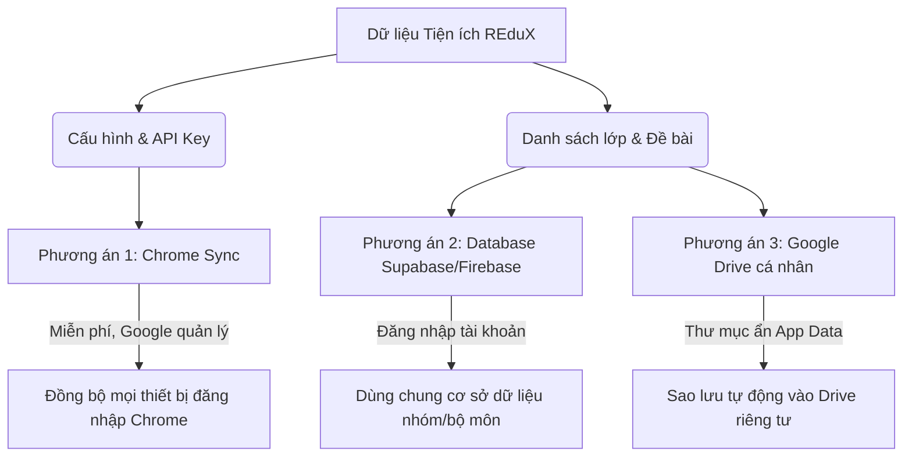

# Đề Xuất Kế Hoạch Nâng Cấp Bảo Mật & Đồng Bộ Cloud Cho REduX

Tài liệu này tổng hợp các đánh giá, nghiên cứu kỹ thuật và lộ trình đề xuất nhằm nâng cấp bảo mật và tích hợp tính năng đồng bộ hóa đám mây cho tiện ích **REduX** trong các phiên làm việc tiếp theo.

---

## 🔒 Phần 1: Các Giải Pháp Tăng Cường Bảo Mật

Nhằm bảo vệ dữ liệu nhạy cảm (như API Keys, Tokens) và chống lại các nguy cơ tấn công từ mã nguồn độc hại của học viên:

### 1. Bảo mật API Key & GitHub Token
* **Vấn đề:** Hiện lưu dưới dạng văn bản thường tại `chrome.storage.local`.
* **Giải pháp ngắn hạn:** 
  * Khuyến nghị giảng viên tạo GitHub Personal Access Token **chỉ có quyền Read-only** đối với repo public.
  * Đặt hạn mức chi tiêu (Budget Limit) cho API Key trên Google AI Studio / DeepSeek Console.
* **Giải pháp trung hạn:** Chuyển đổi phương thức lưu trữ sang `chrome.storage.session` đối với các thông tin cực kỳ nhạy cảm để chúng tự hủy khi đóng trình duyệt Chrome.

### 2. Phòng chống tấn công XSS (Cross-Site Scripting)
* **Vấn đề:** Học sinh có thể cố tình đặt tên file hoặc viết mã nguồn chứa script độc hại. Khi AI trích xuất và hiển thị nội dung nhận xét lên giao diện qua `.innerHTML`, script đó sẽ thực thi trên trình duyệt của giảng viên.
* **Giải pháp:**
  * Giữ nguyên nguyên tắc sử dụng `.textContent` hoặc `.innerText` khi vẽ các bảng danh sách.
  * Tích hợp thư viện làm sạch HTML nhẹ (ví dụ: cấu hình an toàn của `marked.js` hoặc tích hợp `DOMPurify` siêu nhẹ) để khử các thẻ script, iframe độc hại trong báo cáo nhận xét của AI trước khi hiển thị.

### 3. Ràng buộc HTTPS
* **Giải pháp:** Bổ sung regex kiểm tra tại tab Cài đặt để đảm bảo tất cả các API URL (cả Custom AI Provider và nguồn mẫu bài tập) bắt buộc phải sử dụng tiền tố bảo mật **`https://`**.

---

## ☁️ Phần 2: Đề Xuất Các Phương Án Đồng Bộ Cloud

Tùy theo nhu cầu sử dụng thực tế của giảng viên, chúng ta có 3 hướng đi cụ thể cho việc đồng bộ:

### 1. Phương án 1: Đồng bộ Cài đặt qua Google Chrome Sync
* **Mục tiêu:** Đồng bộ API Key, Prompt mẫu và cấu hình ignore list giữa các máy tính.
* **Giải pháp:** Đổi phương thức lưu trữ cấu hình từ `chrome.storage.local` thành **`chrome.storage.sync`** trong `popup.js` và `settingsTab.js`.
* **Độ ưu tiên:** **Cao** (Dễ thực hiện nhất, không tốn chi phí và bảo mật tuyệt đối).

### 2. Phương án 2: Cơ sở dữ liệu đám mây dùng chung (Supabase / Firebase)
* **Mục tiêu:** Chia sẻ ngân hàng đề bài, tiêu chí chấm và lưu lịch sử điểm số của lớp học dùng chung giữa nhiều giảng viên trong tổ bộ môn.
* **Giải pháp:**
  * Đăng ký một dự án Supabase miễn phí (sử dụng PostgreSQL).
  * Tích hợp cơ chế xác thực đăng nhập (Login) trên giao diện cấu hình của REduX.
  * Viết module API Client kết nối trực tiếp đến bảng của Supabase để nạp/lưu điểm học viên và đồng bộ hóa danh sách lớp.
* **Độ ưu tiên:** **Trung bình** (Thích hợp khi có nhu cầu cộng tác nhóm).

### 3. Phương án 3: Sao lưu tự động vào Google Drive cá nhân
* **Mục tiêu:** Tự động sao lưu dự phòng toàn bộ lịch sử điểm và danh sách lớp để đề phòng mất dữ liệu cục bộ.
* **Giải pháp:** Tích hợp Google Drive REST API, yêu cầu phân quyền thư mục ẩn `appFolder` (thư mục này chỉ có tiện ích REduX đọc được, không hiển thị trực tiếp ra ngoài Drive để tránh người dùng xóa nhầm).
* **Độ ưu tiên:** **Trung bình** (Thích hợp cho cá nhân giảng viên muốn backup an toàn).

---

## Lộ trình đề xuất cho phiên làm việc tiếp theo:
1. **Giai đoạn 1:** Triển khai **Phương án 1** (Chuyển cấu hình cài đặt sang `chrome.storage.sync`).
2. **Giai đoạn 2:** Bổ sung bộ kiểm tra tính hợp lệ của HTTPS URL và tối ưu hóa bộ lọc XSS cho nhận xét Markdown.
3. **Giai đoạn 3:** Khảo sát nhu cầu sử dụng Supabase (dùng chung tổ bộ môn) hoặc Google Drive (sao lưu cá nhân) để viết module kết nối Cloud Database thích hợp.
